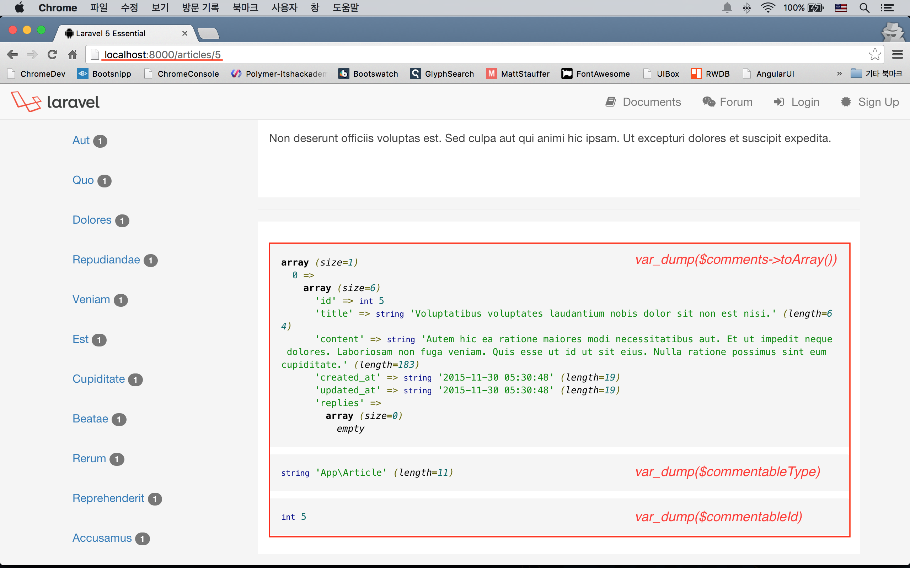
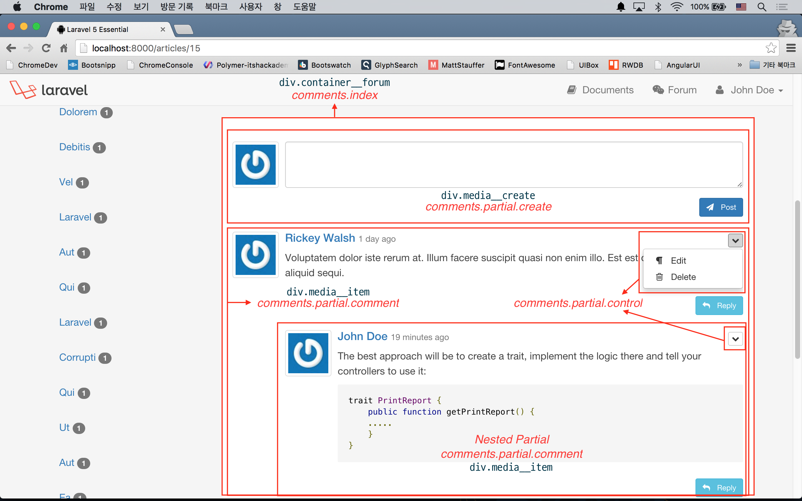

# 실전 프로젝트 2 - Forum

## 40강 - Comment 기능 구현

이번 강에서 Comment 의 기본 기능들을 구현한다. 뷰 구조가 워낙 복잡해서 잘 설명할 수 있을 지 모르겠지만, 최선을 다하리라 다짐해 본다. 뷰에 관심 없는 분들은, 모델과 컨트롤러 코드 위주로 이해하고 넘어가시길 바란다. 다음 강에서도 Markdown Helper Overlay, Markdown 미리보기, Markdown 작성 도우미 등의 사용자 경험을 향상시키기 위한 기능들을 추가해 보려 한다.

### 버그 수정

먼저, 기존에 잘못 작성된 마이그레이션에 `nullable()` 속성을 추가했다. 수정했으니 마이그레이션 실행 `$ php artisan migrate:refresh --seed` 이젠 알아서 척척~

```php
// database/migrations/create_comments_table.php

public function up()
{
    Schema::create('comments', function (Blueprint $table) {
        $table->integer('parent_id')->unsigned()->nullable();
        $table->string('title')->nullable();
        // ...
    }
}
```
 
### 동작 구조 설계
 
[37강 - Article 기능 구현](docs/37-articles.md) 에서 보았듯이, Comment (== 댓글)는 포럼 상세 보기에서 표시할 것이다. 여기에 댓글 목록, 수정 폼, 삭제 폼, 쓰기 폼 등을 덧 붙일 것이다. 즉, `ArticlesController::show()` 메소드에서 앞서 나열한 뷰들에 필요한 데이터를 주어야 한다.

```php
// app/Http/Controllers/ArticlesController.php

public function show($id)
{
    $article = Article::with('comments', 'author', 'tags')->findOrFail($id);
    $commentsCollection = $article->comments()->with('replies', 'author')->whereNull('parent_id')->latest()->get();

    return view('articles.show', [
        'article'         => $article,
        'comments'        => $commentsCollection,
        'commentableType' => Article::class,
        'commentableId'   => $article->id
    ]);
}
```

`App\Article` 모델에서 Morph Many to Many 로 정의한 `comments()` 를 체인해서 `App\Comment` 인스턴스를 얻었다. 얻어진 `App\Comment` 모델에 Eager Loading 으로 `replies()` 등의 관계를 호출한 후 'parent_id'가 `null` 인 레코드들만 가져와서, `$commentsCollection` 에 담았다. 즉, 부모 댓글이 없는 최상위 댓글만 가져오겠단 의미이다.

`view()`를 반환하면서, `$commentableType`, `$commentableId` 변수도 뷰에 바인딩하였다.
 
```html
<!-- resources/views/articles/show.blade.php -->
 
@section('content')
  
  <!-- Other HTML codes ... -->

     <article>
       @include('comments.index')
     </article>
   </div>
  </div>
@stop
```
 
'articles.show' 뷰에서 'comments.index' 뷰를 `@include` 하였다. 'comments.index' 뷰를 만들고 컨트롤러에서 바인딩시킨 변수들이 잘 넘어 왔는 지 확인해 보자.

```html
<!-- resources/views/comments/index.blade.php -->

<div class="container__forum">
  <?php var_dump($comments->toArray()) ?>
  <?php var_dump($commentableType) ?>
  <?php var_dump($commentableId) ?>
</div>
```



### 뷰 구조

앞 절에서 'comments.index' 뷰로 뷰 데이터들이 잘 넘어오는 것을 확인했으니, 뷰 구조를 좀 더 확장해서 볼 것이다. 먼저 아래 그림을 확인하자. 빨강은 뷰 이름, 검정은 HTML class 이름이다. 



```html
<!-- resources/views/comments/index.blade.php -->

<div class="container__forum">
  @if($currentUser)
    @include('comments.partial.create')
  @endif

  @forelse($comments as $comment)
    @include('comments.partial.comment', ['parentId' => $comment->id])
  @empty
  @endforelse
</div>
```

최상위 댓글을 작성할 수 있는 뷰인 'comments.partial.create' 뷰를 로그인이 되었을 경우에만 `@include` 하였다. 

`@forelse` 로 반복하면서, 'comments.partial.comment' 뷰를 이용해 현재 포럼 상세 보기에 해당하 `App\Article` 모델과 연결된 댓글들의 목록을 보여줄 것이다. 여기서 하위 뷰에 `$parentId` 란 변수를 넘겨 주었는데, 이는 하위 뷰에서 대댓글을 작성할 때 유용하게 사용된다.
 
```html
<!-- resources/views/comments/partial/comment.blade.php -->

<div class="media media__item" data-id="{{ $comment->id }}">

  @include('users.partial.avatar', ['user' =>  $comment->author])

  <div class="media-body">
    @if($currentUser and ($comment->isAuthor() or $currentUser->isAdmin()))
      @include('comments.partial.control')
    @endif
  
    <h4 class="media-heading">
      <!-- Gravatar and comment generated time are presented here ... -->
    </h4>
    <p>{!! markdown($comment->content) !!}</p>
    
    @if ($currentUser)
    <p class="text-right">
      <!-- "Reply" button is presented here ... -->
    </p>
    @endif

    @if($currentUser and ($comment->isAuthor() or $currentUser->isAdmin()))
      @include('comments.partial.edit')
    @endif

    @if($currentUser)
      @include('comments.partial.create', ['parentId' => $comment->id])
    @endif

    @forelse ($comment->replies as $reply)
      @include('comments.partial.comment', ['comment'  => $reply])
    @empty
    @endforelse
  </div>
</div>
```

이 뷰에서는 현재 화면에 뿌리는 댓글을 수정 또는 삭제를 트리거하기 위한 컨트롤 요소를 'comments.partial.control' 뷰에 포함하고 있다. 

또, 대댓글을 작성하는 'comments.partial.create' 폼, 현재 댓글을 수정할 수 있는 'comments.partial.edit' 폼을 포함하고 있다. Article 모델과 같이 Comment 모델에도 `isAuthor()` 메소드를 추가했는데, 이렇게 중복이 발생하는 경우에는 trait 로 빼는 것이 좋을 것 같다. 

이 뷰에서 가장 눈여겨 볼 것은, 재귀적으로 뷰를 `@include` 하고있다는 것이다. 다시 말하면, `$comment->replies` 값이 있으면 (== 대댓글), 자기 뷰 안에 자기 자신 즉, 'comments.partial.comment' 자식뷰를 계속 Nesting 한다는 것이다. 

```html
<!-- resources/views/comments/partial/create.blade.php -->

<div class="media media__create">
  @include('users.partial.avatar', ['user' => $currentUser])
  <div class="media-body">
    <form action="{{ route('comments.store') }}" method="POST" role="form" class="form-horizontal form-create-comment">
      {!! csrf_field() !!}
      <input type="hidden" name="commentable_type" value="{{ $commentableType }}">
      <input type="hidden" name="commentable_id" value="{{ $commentableId }}">
      @if(isset($parentId))
        <input type="hidden" name="parent_id" value="{{ $parentId }}">
      @endif
      
      <!-- Other HTML form tags ... -->

    </form>
  </div>
</div>
```

앞서 보았듯이, 위 뷰는 일반 댓글을 작성하기 위한 폼으로도, 'comments.partial.comment' 의 재귀적 호출 즉, 댓글의 댓글을 작성하기 위한 폼으로도 사용된다. 재귀적 호출일 때, 일종의 플래그 역할을 하기 위해서 하위 뷰에 `$parentId` 변수를 넘겨 주었고, 위 댓글 작성 폼이 최상위 댓글이 아니라 댓글의 댓글 작성 폼으로 사용되었을 때 부모 댓글이 있음을 `CommentsController::store()` 에 알리기 위해서 `@if(isset($parentId))` 로 숨김 필드를 선택적으로 생성하였다.

현재 로그인한 사용자, 즉 신규 댓글을 작성할 사용자의 사진을 보여주기 위해 `@include('users.partial.avatar', ['user' => $currentUser])` 를 호출했고, 뷰에 공유된 데이터인 `$currentUser` 를 넘겨 주었다.

댓글 작성 후 폼 전송을 하게 될 텐데, 이 때 서버 측이 어떤 모델의 어떤 id에 연결시킬 지 힌트를 주기 위해 `$commentableType`, `$commentableId` 변수를 숨김 필드에 담았다.

```html
<!-- resources/views/comments/partial/control.blade.php -->

<div class="dropdown pull-right hidden-xs hidden-sm">
  <span class="dropdown-toggle btn btn-default btn-xs" type="button" data-toggle="dropdown">
    {!! icon('dropdown') !!}
  </span>
  <ul class="dropdown-menu" role="menu">
    <li role="presentation">
      <a role="menuitem" tabindex="-1" alt="edit" class="btn__edit">
        {!! icon('update') !!} Edit
      </a>
    </li>
    <li role="presentation">
      <a role="menuitem" tabindex="-1" alt="delete" class="btn__delete">
        {!! icon('delete') !!} Delete
      </a>
    </li>
  </ul>
</div>
```

댓글 수정 및 삭제 컨트롤 UI를 위해 [Bootstrap Dropdowns](http://getbootstrap.com/components/#dropdowns) 에서 디자인을 훔쳐와서 적용했을 뿐, 구현상 특별한 점은 없다.

```html
<!-- resources/views/comments/partial/edit.blade.php -->

<div class="media media__edit">
  <div class="media-body">
    <form action="{{ route('comments.update', $comment->id) }}" method="POST" role="form" class="form-horizontal">
      {!! csrf_field() !!}
      {!! method_field('PUT') !!}

      <div class="form-group" style="width:100%; margin: auto;">
        <textarea name="content" class="form-control" style="width:100%; padding:1rem;">{{ old('content', $comment->content) }}</textarea>
        {!! $errors->first('content', '<span class="form-error">:message</span>') !!}
      </div>

      <p class="text-right" style="margin:0;">
        <button type="submit" class="btn btn-primary btn-sm" style="margin-top: 1rem;">
          {!! icon('plane') !!} Edit
        </button>
      </p>
    </form>
  </div>
</div>
```

수정 폼도 우리가 앞에서 흔히 봐 왔던 폼이다. 다만 이미 'commentable_type', 'commentable_id' 가 이미 저장되어 있는 `App\Comment` 모델을 수정하는 것이므로, 기존의 댓글 작성 폼과 달리 숨김 필드가 필요 없다.

여기까지 작업하고 테스트해 보면, 에러가 날 것이다. Route 정의와 컨트롤러가 없어서 이다.

### 컨트롤러 구현

```bash
$ php artisan make:controller CommentsController --resource
```

'index', 'create', '...' 뷰 요청하는 메소드는 필요없으므로 Route 정의에서 제외했다.

```php
// app/Http/routes.php

Route::resource('comments', 'CommentsController', ['only' => ['store', 'update', 'destroy']]);
```

#### 댓글 생성 로직 구현

댓글 기능을 한번만 구현하고, `App\Article`, `App\Something`, ... 여러 모델에서 사용하기 위해서 우리가 선택한 디자인은 Morph Many to Many 였다 (사실은 학습 목적이 더 강하다). 이 절의 컨트롤러 구현에서 여러 모델에서 Comment 기능을 공유해서 쓰기 위해, 어떻게 했는 지 눈여겨 살펴보기 바란다.

```php
// app/Http/Controllers/CommentsController.php

class CommentsController extends Controller
{
    public function __construct()
    {
        $this->middleware('auth');
        $this->middleware('author:comment', ['except' => ['store']]);
    }

    public function store(Request $request)
    {
        $this->validate($request, [
            'commentable_type' => 'required|in:App\Article',
            'commentable_id'   => 'required|numeric',
            'parent_id'        => 'numeric|exists:comments,id',
            'content'          => 'required',
        ]);

        $parentModel = "\\" . $request->input('commentable_type');
        $parentModel::find($request->input('commentable_id'))
            ->comments()->create([
                'author_id' => \Auth::user()->id,
                'parent_id' => $request->input('parent_id', null),
                'content'   => $request->input('content')
            ]);

        flash()->success(trans('forum.comment_add'));

        return back();
    }
}
```

유효성 검사 규칙 중에 'in:App\Article' 부분이 보일 것이다. 연결된 모델이 늘어나면, 'in:App\Article,App\Something' 처럼 콤마(,)를 찍고 계속 넣을 수 있다. 

'parent_id' 유효성 검사에서는 'exists:comments,id' 을 쓰고 있는데, 'comments' 테이블에 `whereId($request->input('parent_id'))`로 쿼리했을 때 레코드가 있어야 한다는 의미이다. 그럴 경우는 거의 없겠지만, 대댓글을 작성하는 중에 원본 댓글의 작성자가 삭제하는 경우를 생각해 볼 수 있을 것이다.

`$parentModel = "\\" . $request->input('commentable_type')` 은 문자열 '\App\Article' 을 생성하고 `$parentModel` 변수에 담는다. 코드에서 `$parentModel::find()` 는 결국 `\App\Article::find()` 로 치환된다. 유효성 검사를 한번 거쳤으므로 없는 모델에 쿼리하는 Exception 은 발생하지 않을 것이다.

#### 미들웨어 수정

위 절의 `CommentsController::__construct()` 에서 `ArticlesController::__construct()` 에서 썼던 `CanAccessArticle (별칭 'accessible')` 미들웨어를 썼다. 권한에 맞게 생성, 수정, 삭제 UI를 뷰에서 숨겼다고는 하나, ArticlesController 에서와 마찬가지로 HTTP Client 를 이용하여 직접 요청하는 경우에 대해서도 방어해야 하기에... [미들웨어 파라미터](http://laravel.com/docs/middleware#middleware-parameters) 기능을 이용해서 여러 컨트롤러에서 사용할 수 있도록 기존 미들웨어를 수정해 보자.

네이밍은 항상 힘들다. 'CanAccessArticle' 에서 좀 더 일반적인 'AuthorOnly' 로, 그리고 별칭은 'author' 로 수정했다.

```php
// app/Http/Kernel.php

protected $routeMiddleware = [
    // ...
    'author' => \App\Http\Middleware\AuthorOnly::class,
];
```

미들웨어 파라미터 사용법이다. `handle()` 메소드의 세번째 인자로 `$param`을 받았다. 이는 소문자로 된 모델 이름이라고 우리 나름의 규칙을 정하자.  `$model` 을 받아 오는 부분은 `CommentsController::store()` 에서 한거랑 비슷한 구현이다. `str_plural(string $value)` 은 라라벨 내장 Helper 로, 인자로 넘겨 받은 영문으로 된 `$value` 를 복수 단어로 변환해 준다.

미들웨어 파라미터는 컨트롤러에서 `$this->middleware('미들웨어별칭:파라미터')` 식으로 쓸 수 있다.

```php
// app/Http/Middlewares/AuthorOnly.php

public function handle(Request $request, Closure $next, $param)
{
    $user = $request->user();
    $model = '\\App\\' . ucfirst($param);
    $modelId = $request->route(str_plural($param));

    if (! $model::whereId($modelId)->whereAuthorId($user->id)->exists() and ! $user->isAdmin()) {
        flash()->error(trans('errors.forbidden') . ' : ' . trans('errors.forbidden_description'));
        return back();
    }

    return $next($request);
}
```

미들웨어를 수정했으니 기존의 `ArticlesController` 도 `$this->middleware('author:article', [...]);` 로 수정해 주자.

#### 댓글 수정 및 삭제 로직 구현

수정 로직은 특별한게 없다. 일단, 아래 코드를 보자.

```php
// app/Http/Controllers/CommentsController.php

class CommentsController extends Controller
{
    // Other methods ...
    
    public function update(Request $request, $id)
    {
        $this->validate($request, ['content' => 'required']);
    
        Comment::findOrFail($id)->update($request->only('content'));
        flash()->success(trans('forum.comment_edit'));
    
        return back();
    }
    
    public function destroy(Request $request, $id)
    {
        $comment = Comment::find($id);
        $this->recursiveDestroy($comment);

        if ($request->ajax()) {
            return response()->json('', 204);
        }

        flash()->success(trans('forum.deleted'));

        return back();
    }

    public function recursiveDestroy(Comment $comment)
    {
        if ($comment->replies->count()) {
            $comment->replies->each(function($reply) {
                if ($reply->replies->count()) {
                    $this->recursiveDestroy($reply);
                } else {
                    $reply->delete();
                }
            });
        }

        return $comment->delete();
    }
}
```

개인의 취향일 수도 있다. 마이그레이션에서 정의한 `$table->foreign('parent_id')->references('id')->on('comments')->onDelete('cascade');` 에 의해 대댓글은 자동 삭제된다. 그런데 필자의 경우에는, 좀 더 안전하게 하기 위해서, 코드 레벨에서 먼저 한번 삭제한다. 이를 위해서, `recursiveDestroy()` 라는 재귀적 호출을 하는 메소드를 만들었고, `destroy()` 메소드에서 호출하였다.

그런데... 댓글을 직접 삭제하는 경우도 있지만, Comment 의 부모 모델인 Article 을 삭제하는 경우도 있다. 우리 모델은 'Morph Many to Many' 라는 것을 기억하자. 즉, 데이터베이스의 외래키 관계가 형성될 수 없다는 의미이다. 그렇다면 Article 모델이 삭제되면 연결된 Comment 도 삭제하도록 코드 레벨에서 구현해야 한다. 그런데 여기서, 디자인 의사 결정이 필요하다. 'Article 이 삭제되었으니, 연결된 그 자식 모델들도 전부 삭제할거냐? 남겨 놓고, '삭제된 글'이라는 자리표시자(== Placeholder) 를 남기고 댓글은 삭제하지 말고 남겨 놓을 것인가?' 의 결정. 여기서는 전부 삭제하는 것으로 하자.

```php
// app/Http/Controllers/ArticlesController.php

public function destroy($id)
{
    $article = Article::with('attachments', 'comments')->findOrFail($id);

    foreach($article->attachments as $attachment) {
        \File::delete(attachment_path($attachment->name));
    }

    $article->attachments()->delete();
    $article->comments->each(function($comment) { // foreach 로 써도 된다.
        app(\App\Http\Controllers\CommentsController::class)->recursiveDestroy($comment);
    });
    $article->delete();

    flash()->success(trans('forum.deleted'));

    return redirect(route('articles.index'));
}
```

이 강좌와 관련된 부분은 `$article->comments->each(function($comment) {...}` 부분인데, `app()` Helper 로 다른 컨트롤러에 있는 메소드를 접근하고 있다. 사실상은 Anti-pattern 이며, `recursiveDestroy()` 메소드를 trait 등으로 빼는 것이 좋을 것 같다. 

### 화장하기

여기까지 작성하고, 브라우저에서 보면 스크린샷 처럼 나오지 않고, 아주 못~쉥긴 댓글 뷰가 표시될 것이다. 아래와 같은 뷰 로직을 생각해 보자.


  
1. 최상위 'comments.partial.create' 는 항상 표시된다.
2. 페이지 로드시 'comments.partial.comment' 에 포함된 현재 댓글 수정 폼, 대댓글 작성 폼은 표시되지 않는다.
3. 'Reply' 버튼을 클릭하면 해당 댓글 아래에 대댓글 작성 폼이 토글(표시/숨김) 된다. 해당 댓글에 수정 폼이 표시되어 있다면 숨긴다.
4. 'comments.partial.control' 조각 뷰에서 수정을 선택하면 해당 댓글 수정 폼이 표시된다. 해당 댓글에 대댓글 작성폼이 표시되어 있다면 숨긴다.
5. 'comments.partial.control' 조각 뷰에서 삭제를 선택하면 해당 댓글 삭제 Ajax 이 나가고, 삭제 성공시 플래시 메시지를 표시한다.

위 내용을 구현한 CSS, JS 코드인데, 코드에 대한 설명은 생략한다. 일단 jQuery로 썼는데, 이 코스를 통해서 기회가 된다면 [Vue.js](http://vuejs.org/) 로 다시 쓸 생각이다. 라라벨과 같은 완벽한 Backend 를 갖추고, 프론트엔드에서 또 다시 AngularJS 와 같은 모든 것을 갖춘 프레임웍을 쓴다는 것은 오버라는 생각이든다 (개발해야 할 코드량이 많다는 의미다). 그런 면에서 뷰 모델만 건드리는 Vue.js 와 같은 라이브러리가 합리적인 선택이라 생각된다.
  
```html
<!-- resources/views/comments/index.blade.php -->

@section('style')
  <style>
    /* 2. 페이지 로드시 'comments.partial.comment' 에 포함된 현재 댓글 수정 폼, 대댓글 작성 폼은 표시되지 않는다. */
    div.media__create:not(:first-child),
    div.media__edit {
      display: none;
    }
  </style>
@stop

@section('script')
  <script>
    $("button.btn__reply").on("click", function(e) {
      // 3. 'Reply' 버튼을 클릭하면 해당 댓글 아래에 대댓글 작성 폼이 토글(표시/숨김) 된다. 
      // 해당 댓글에 수정 폼이 표시되어 있다면 숨긴다.
      var el__create = $(this).closest(".media__item").find(".media__create").first(),
          el__edit = $(this).closest(".media__item").find(".media__edit").first();

      el__edit.hide("fast");
      el__create.toggle("fast").end().find('textarea').focus();
    });

    $("a.btn__edit").on("click", function(e) {
      // 4. 'comments.partial.control' 조각 뷰에서 수정을 선택하면 해당 댓글 수정 폼이 표시된다. 
      // 해당 댓글에 대댓글 작성폼이 표시되어 있다면 숨긴다.
      var el__create = $(this).closest(".media__item").find(".media__create").first(),
          el__edit = $(this).closest(".media__item").find(".media__edit").first();

      el__create.hide("fast");
      el__edit.toggle("fast").end().find('textarea').first().focus();
    });

    $("a.btn__delete").on("click", function(e) {
      // 5. 'comments.partial.control' 조각 뷰에서 삭제를 선택하면 해당 댓글 삭제 Ajax 이 나가고, 
      // 삭제 성공시 플래시 메시지를 표시한다.
      var commentId = $(this).closest(".media__item").data("id");

      if (confirm("Are you sure to delete this comment?")) {
        $.ajax({
          type: "POST",
          url: "/comments/" + commentId,
          data: {
            _method: "DELETE"
          }
        }).success(function(data) {
          flash('success', 'Deleted ! The page will reload in 3 secs.', 2500);
          reload(3000);
        })
      }
    });
  </script>
@stop
```

이번 강좌를 진행하는 동안 'resources/assets/js/app.js' 에 자잘한 Cosmetic Change 들이 있었다. 변경 내용들은 Commit 로그를 참고하도록 하자.

<!--@start-->
---

- [목록으로 돌아가기](../readme.md)
- [39강 - Attachment 기능 구현](39-attachments.md)
- [32/33 보충 - 인증 리팩토링](32n33-auth-refactoring.md)
- [41강 - UI 개선](41-ui-makeup.md)
<!--@end-->
